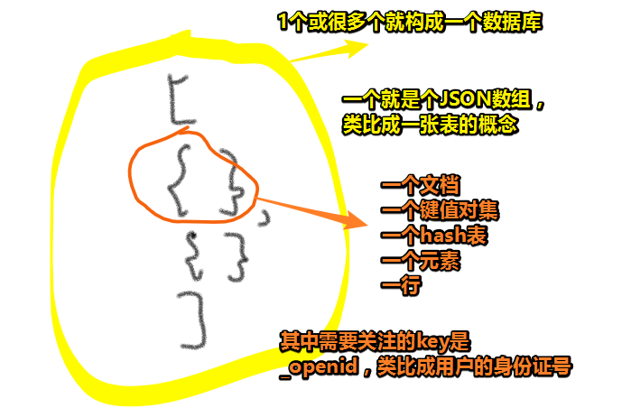
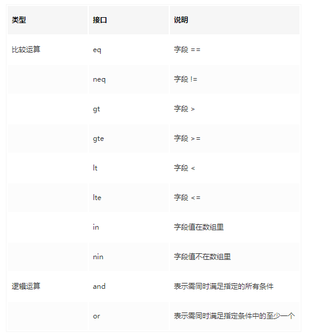
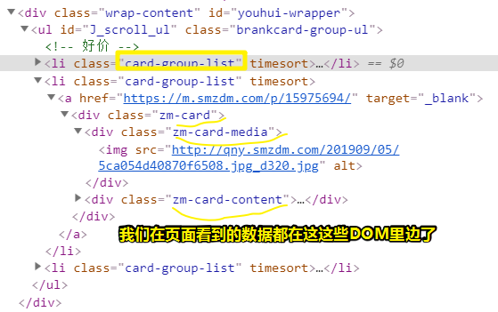
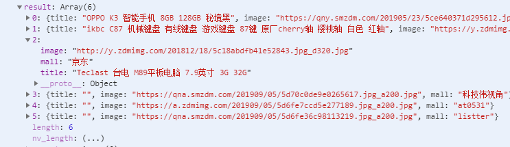

# 基础篇 2：小程序·云开发基础知识

## ★为什么需要？

1. 小程序开发中用到的服务器、数据库和静态资源管理，都可以托管到「小程序·云开发」上，小程序开发者只需要关注业务功能实现，而不需要关心服务器运维等带来的问题
2. 小程序开发主要用到的是前端技术，后端开发和服务运维对于前端开发者来说有一定的门槛，而小程序·云开发的出现就是解决这个问题的。

总之，小程序·云开发为开发者提供完整的云端流程，**弱化后端和运维概念**，开发者无需购买和管理底层计算资源，包括服务器、数据库、静态存储，只需**使用平台提供的简易 API** 进行核心业务等开发，**实现快速上线和迭代**，把握业务发展的黄金时期。

## ★它有哪些功能？

小程序·云开发提供数据库、云函数和静态存储三大功能，还有小程序的用户管理功能，在用户管理界面可以轻松掌握小程序的授权用户情况。

## ★如何申请小程序·云开发？

1. 在开发界面里边，点击「云开发」这个按钮
2. 根据提示，配置「环境名称」和「环境ID」
3. 你的小程序要想调用云开发，那么你此之前，你需要先调用 `wx.cloud.init` 对云开发进行初始化：

```js
wx.cloud.init({
  env: 'tianqi-xxx'
})
```

这个 JS 代码 在 `app.js` 里边写上即可！

4. 如何确保云开发初始化成功呢？——在云开发控制台里边，你点开「用户访问」会看到一些比如「今日活跃用户」为1人，那么你看到这个就是初始化成功了。当然，你可以打开「调试器」，会看到「云开发 wx.cloud.init 环境初始化」这样的字眼也是成功的标志！

## ★小程序·云开发的三大功能

### ◇数据库

- 每个数据库是由什么组成的？
  - 每个数据库是由多个集合（collection，类比关系型数据库中表的概念）组成
- 集合又是由什么组成的？
  - 集合有多个 JSON 文档（行）组成
- 集合即数组
  - NoSQL 的特点是**没有固定的字段**，所以整个集合可以看成一个大的 JSON 数组
- 一个集合在数据库中的存储格式如下：

```json
[
  {
    "_id": 1,
    "_openid": "ax123CVadb",
    "name": "Alice",
    "city": "Guangzhou"
  },
  {
    "_id": 2,
    "_openid": "xj372nJdfa",
    "name": "Bob",
    "city": "Shenzhen"
  }
]
```

可以看到，一个集合里边有两行数据，或者说是两个文档，或者说两个使用该小程序的用户的数据……

其中，文档中的 `_id` 是唯一的，开发者可以插入数据的时候自定义，另外 `_openid` 是增加文档默认创建的，代表当前小程序 用户的唯一标示，而这点内容会涉及到小程序的用户授权相关的内容。

::: warning

我直接在云开发控制台里边创建集合 `test-db`，然后生成的文档，并没有 `_openid`这个字段呀！直接就是添加一个记录就会自动生成一个`_id` 。而当我在微信开发者工具里边，通过 JS 代码为 `test-db` 增加一条记录时就会默认为文档多增加两个字段，一个是 `_id`，另一个是`_openid` 。

:::



> 数组中的一个元素，似乎就是叫做一个文档行，而不是把「文档」和「行」拆开来看，不过，叫「行」也没事，反正联想到关系型数据库里边的表的行，都表示一个东西，都是一条记录！

#### 如何操作数据库？

以下是小册作者整理出常用的 API 使用方法：

```js
// 初始化
wx.cloud.init({
  env: 'tianqi-xxx'
})
// 获取数据库实例
const db = wx.cloud.database()
// 增
db.collection('集合名称').add({
  data: {} // 插入的数据
}).then(res => {
  // 可以通过 res._id 获取创建的记录的 id
  console.log(res._id)
})
// 删
db.collection('集合名称').doc('文档 ID').remove().then(res => {
  console.log('removed')
})
// 改
db.collection('集合名称').doc('文档 ID').update({
  data: {
    title: '我的第 1 篇文章', // 只更新 title 字段，其他不更新
  }
}).then(res => {
  // 可以通过 res._id 获取创建的记录的 id
  console.log(res._id)
})
// 查
db.collection('集合名称').doc('文档 ID').get().then(res => {
  // 打印结果，res.data 即为记录的数据
  console.log(res)
})
const _ = db.command // 取指令
db.collection('集合名称').where({
  // 查找条件
  category: 'computer',
  properties: {
    memory: _.gt(8), // 表示大于 8
  }
})
```

小程序·云开发的数据库**查询命令**是可以**使用查询筛选指令**的，使用查询筛选指令可以**缩小查询范围**，找到查询条件的文档。

以下指令挂载在 `db.command`旗下：



> 举例说明：在 `diary` 集合中找出 `openid` 某个值并且创建时间（`tsModified`）在 `start` 和 `end` 之间的文档。

```js
db
  .collection('diary')
  .where({
    openid,
    tsModified: _.gte(start).and(_.lt(end))
  })
  .get()
```

::: warning

为啥叫集合？——因为在使用API的时候，就有个叫 `collection`东东让我们指定是操作数据库（`db`）里边的哪个 JSON 数组！

:::

#### 数据库的索引

为啥需要？

> 增加合适的索引可以提升文档的查找效率，比如根据时间、用户 ID 查找，可以将时间和用户 ID 字段设置为索引项，小册作者在使用的时候发现：**在小程序·云开发管理后台并不能对某个字段增加唯一索引。**

::: warning

现在可以对某个字段增加唯一索引

:::

#### 自带权限管理

为什么需要？

> 在研发中，**经常会针对不同的用户设置不同的数据库权限**，例如：某条记录是用户 A 创建的，则只有用户 A 可以删除或者更新，其他用户只有查看的权限，这样的**需求很常见，实际开发起来却非常费劲**，往往要写不少权限判断的代码，小程序·云开发的数据库支持「权限管理」功能，可以**针对这类需求对不同的集合进行统一处理，大大降低开发的门槛**！

那么，一个集合有哪些操作权限呢？

集合的操作权限包括以下四种：

- 所有用户可读，仅创建者及管理员可写
- 仅创建者及管理员可读写
- 所有用户可读，仅管理员可写
- 仅管理员可读写

::: warning

什么场景对集合设置什么权限，云开发控制台里边的「权限设置」会有提到。如 场景是「商品信息等」，那么针对这个场景的集合的权限，那就设置为「所有用户可读」呗！

可见，通过权限设置，可以控制数据给哪些人看/写，不给哪些人看/写。

:::

在哪里设置权限？

> 可以在「云开发 -> 数据库 -> 选择某个集合 -> 权限设置」页面进行设置

### ◇文件存储

为什么需要？

> 小程序·云开发的文件存储功能是专为**存储**和提供**用户生成的内容**（如图片或视频）的开发者打造的。开发者可**使用腾讯云的 SDK** 来存储图片、音频、视频或其他由用户生成的内容。在小程序内，则可以**通过云开发的 API 直接上传、下载和管理存储**。

看看能存多少东西？

存储容量，免费5GB

**➹：**[配额说明 | 微信开放文档](https://developers.weixin.qq.com/miniprogram/dev/wxcloud/billing/quota.html)

如何上传资源？

公共使用的静态资源，可以通过「云开发 -> 存储」**界面直接上传和管理**，上传之后，就可以在界面内找到资源的 CDN 地址。

而对于小程序内需要上传和管理的则通过下面几个 API 来实现：

```js
// 上传，上传后会返回资源的 ID
wx.cloud.uploadFile
// 下载
wx.cloud.downloadFile
// 根据资源 ID 获取资源访问地址
wx.cloud.getTempFileURL
// 根据资源 ID 列表删除某资源
wx.cloud.removeFile
```


也能权限设置吗？

跟数据库权限管理一样，如果需要用户自己上传的内容自己可以管理，那么需要设置存储的操作权限，在「云开发 -> 存储」下可以设置全局的存储操作权限。

::: warning

小程序管理员岂不是可以读写用户的任何数据？

:::

### ◇云函数

#### 是什么？

> 云函数是腾讯云提供的一套函数计算解决方案，我们可以将每个功能 API 做成单个可执行的函数，然后放到腾讯云上去托管，每个云函数是相互独立可执行的。代码编写完成后放到云端，不执行不调用不收费，执行调用按照调用次数和 CPU 等计算资源的占用情况收费。

#### 为什么需要？

> 有了云函数，开发者无须搭建和购买服务器，只需要将写好的云函数代码上传部署到腾讯云，即可以在小程序内通过 `wx.cloud.callFunction` 的方法进行调用。

#### 如何创建一个云函数？

1. 到 `project.config.json`里边新增一个字段：

```json
{
   "cloudfunctionRoot": "./functions/"
}
```

2. 在根目录下创建一个叫 `functions`的目录，右击它，选择「上传并部署」，此时它会有个云图标标志
3. 右击 `functions`目录，选择新建 Node.js 云函数，随便输入一个 名字，如 `add`
4. 在 `add`目录里边的 `index.js`里边搞下边这样的代码，这样我们一个有一定功能的函数就出来了！

```js
// 云函数入口文件
const cloud = require('wx-server-sdk')

cloud.init()

// 云函数入口函数
exports.main = async (event, context) => {
  return {
    sum: event.a + event.b
  }
}
```

5. 使用这个云函数（直接在app.js里边测试就好了）：

```js
wx.cloud.callFunction({
  // 云函数名称
  name: 'add',
  // 传给云函数的参数
  data: {
    a: 1,
    b: 2,
  },
  success: function (res) {
    console.log(res.result.sum) // 3
  },
  fail: console.error
})
```

6. 保存文件，打开调试器，即可看到有个 `3`log出来了！

::: warning

每次更新云函数的 `index.js`文件，保存后，都得右击该文件，选择「云函数增量上传：更行文件」，这样本地使用的时候，才会是最新版的云函数！

:::

你可以看到我们在调用云函数 `add` 的时候，需要把callback写在里边，而这样形式上看就很不好看了，我们想要的形式应该就只有函数的name以及给函数的参数，所以引入了 Promise 的写法：

修改`add`云函数如下：

```js
// 云函数入口文件
const cloud = require('wx-server-sdk')

cloud.init()

// 云函数入口函数
exports.main = async (event, context) => {
  return new Promise((resolve, reject) => {
    resolve({
      sum: event.a + event.b
    })
  })
}
```

使用云函数的姿势如下：

```js
wx.cloud.callFunction({
  // 云函数名称
  name: 'add',
  // 传给云函数的参数
  data: {
    a: 1,
    b: 2,
  }
}).then(res => {
  // 因为 main 的方法实际是个 promisify 的返回，所以可以直接使用 then/catch
  console.log(res.result.sum) // 3
}).catch(e => {
  console.log(e)
})
```

可见，我们调用云函数 `add`姿势变得简洁很多！

::: tip

1. 云函数如果不存在 `main` 的方法，上传部署的时候会报错！
2. 云函数回调方式写法遵循「错误优先」原则（Error-First Callback）。

:::

解析一下写云函数时的那两个形参 `event`、`context`：

云函数接受两个 JSON 格式的参数 `event` 和 `context`，两者分别代表：

- `event`：平台将 `event` 入参传递给执行方法，通过此 `event` 入参对象，代码将与触发函数的事件（event）交互，`event` 可以获取 `wx.cloud.callFunction` 调用的参数 `data`
- `context`：平台将 `context` 入参传递给执行方法，通过此 `context` 入参对象，代码将能了解到运行环境及当前请求的相关内容

::: tip
开发者可以在云函数内获取到每次调用的上下文（appId、openId 等），无需维护复杂的鉴权机制，即可获取天然可信任的用户登录态（openId），这俩值可以从`event.userInfo`中读取。

:::

#### 云函数的依赖管理

是什么？

> 在云函数中，可以像正常的 Node.js 一样，使用 `package.json` 和 `node_modules` 来对依赖进行管理，在开发完代码之后，需要将 `node_modules` 文件夹一起上传到云端去。

#### 小例子

> 做一个「[什么值得买](https://www.smzdm.com/)」的简单抓取的云函数，讲解函数编写、npm 模块使用、云函数本地测试整个流程。

要实现的功能：

> 1. 根据传入的分类参数，获取什么值得买对应分类的最新文章内容
> 2. 提取出文章列表的 title、image、mall，即文章名称、文章的配图和优惠所属的网站

做法如下：

①创建一个叫 `smzdm`的云函数

② `yarn init`一下 `smzdm`这个目录，不过默认就存在 `package.json`这个文件，虽然根据情况选择是否 `init`，当然，即便有了， `init`一下也没事哈！

③安装抓取「什么值得买」手机站点的两个 npm 模块： `yarn add request cheerio`

- [request](https://link.juejin.im/?target=https%3A%2F%2Fwww.npmjs.com%2Fpackage%2Frequest)：用于做数据请求，抓取站点的 HTML 内容
- [cheerio](https://link.juejin.im/?target=https%3A%2F%2Fwww.npmjs.com%2Fpackage%2Fcheerio)：用于将 HTML 结构数据转为类似 jQuery 的对象，可以通过 CSS 选择器对 HTML 的内容进行提取

④始编写 index.js 内容

第一步，引入模块，编写 `main` 方法：

```js
// 引入 requst 和 cheerio
const request = require('request')
const cheerio = require('cheerio')
exports.main = async (event = {}) => {
  // 获取具体什么值得买网站分类
  let category = event.category || 'diannaoshuma'
  return new Promise((resolve, reject) => {

  })
}
```

第二步，开始编写具体的逻辑，即使用 `request.get` 先获取 [HTML 内容](https://m.smzdm.com/fenlei/diannaoshuma/)，然后使用 `cheerio` 将 HTML 内容进行结构化。

经过使用 Chrome 查看器查看，发现最新文章都包含在一个 `class` 为 `card-group-list` 的 div 下，



然后找到 `zm-card-title` 等每个文章的标题、图片和商城信息，将结果放到一个数组，最后 `resolve` 输出：

```js
const request = require('request')
const cheerio = require('cheerio')
exports.main = async (event = {}) => {
  let category = event.category || 'diannaoshuma'
  return new Promise((resolve, reject) => {
    request.get(`https://m.smzdm.com/fenlei/${category}/`, (e, req, body) => {
      if (!e && req.statusCode === 200) {
        const $ = cheerio.load(body)
        const result = []
        $('.card-group-list').each((i, v) => {
          let $v = $(v)
          let title = $v.find('.zm-card-title').text().trim()
          let image = $v.find('.zm-card-media img').attr('src')
          let mall = $v.find('.card-mall').text().trim()
          result.push({
            title,
            image,
            mall
          })
        })
        resolve(result)
      }
    })
  })
}
```

::: tip

在测试该函数的功能的时候，可以借助 VS Code 的 Run Code 插件，看看代码的运行，是否按预期的进行，如果得到了预期的结果，才把代码扔到 promise 里边的callback里边去，然后再把结果 resolve 出去，而这个结果会被对方调用这个云函数 `smzdm` 的第一个then里边的第一个callback接收到

:::

这样就完成了一个**带有依赖模块**的云函数编写，上传到腾讯云部署之后，在小程序中使用：

```js
wx.cloud.callFunction({
  name: 'smzdm',
  data: {
    category: 'diannaoshuma'
  }
}).then(r=>{console.log(r)})
```

结果：



::: warning

依赖模块也要上传！即 选择 「上传并部署：所有文件」

:::

> 爬取人家的数据？爬虫么？这个程序？

#### 云函数的调试


## ★Q&A

### ①SDK和API的区别？

缘由：第一次创建云函数时，然后创建成功后，工具会提示是否立即本地安装依赖，确定后工具会自动安装 [`wx-server-sdk`](https://developers.weixin.qq.com/miniprogram/dev/wxcloud/guide/functions/wx-server-sdk.html)。

直接理解：

- SDK（Software Development Kit，软件开发工具包）＝放着你想要的软件功能的软件包；API＝SDK上唯一的接口
- SDK 是可以下载的。API 是写在文档里的。

白话理解：

有一杯密封饮料，它的名字叫做“SDK”。

饮料上插着吸管，吸管的名字叫“API”。

把你叫做“XX系统”。

如果你想喝到SDK里的饮料（让系统拥有SDK中的功能），你必须通过API这根吸管来实现（通过API连接你的系统和SDK工具包），否则你就喝不到饮料。

自己理解：

不想写xxx功能？

有个SDK里边有放着一份xxx功能，你想使用它吗？——那你就学会使用它提供的API吧！

::: warning

辅助开发某一类软件的**相关文档、范例和工具的集合**都可以叫做SDK。

SDK被开发出来是为了减少程序员工作量的。

:::

所以，我第一次创建云函数的时候，工具自动帮我下载了个SDK（叫wx-server-sdk），通过这个SDK，自动帮我创建了一个云函数模板！

**➹：**[SDK和API的区别？ - 知乎](https://www.zhihu.com/question/21691705)

### ②No SQL 和SQL？

简单理解：

1. NoSQL(NoSQL = Not Only SQL )，意即"不仅仅是SQL"。一种概念性的东西。
2. SQL（Structured Query Language，结构化查询语言） 是用于访问和处理数据库的标准的计算机语言。

延伸理解一个叫 「RDBMS」的的东西：

1. RDBMS 指关系型数据库管理系统，全称 Relational Database Management System。
2. RDBMS 是 SQL 的基础，同样也是所有现代数据库系统的基础，比如 MS SQL Server、Oracle、MySQL……
3. RDBMS 中的数据存储在被称为**表**的数据库对象中。
4. 表是相关的数据项的集合，它由列和行组成。

回顾头来看 NoSQL：

1. NoSQL，指的是非关系型的数据库。是对不同于传统的关系型数据库的数据库管理系统的统称
2. NoSQL用于超大规模数据的存储。这些类型的数据存储不需要固定的模式，无需多余操作就可以横向扩展。

No SQL 和 SQL 的简单区别：

1. No SQL ：存储数据的时候不使用关系型结构，也就是不使用行列表存储结构
2. SQL：存储数据时需要使用行列表存储结构

何时用No SQL？

1. 一般是用在社交网站上。因为社交网站对数据的一致性要求相对较低，就是用户a点个赞在用户b那里显不显示出来影响相对较小

关于小程序·云开发：

小程序·云开发的数据库是一种 **NoSQL** 云端数据库，数据以 JSON 格式存储，从提供的文档和接口来看，云开发的数据库应该是由 **MongoDB** 实现的。

**➹：**[SQL 简介 | 菜鸟教程](https://www.runoob.com/sql/sql-intro.html)

**➹：**[NoSQL 简介 | 菜鸟教程](https://www.runoob.com/mongodb/nosql.html)

**➹：**[NoSql是一种语言，还是一种概念？ - 知乎](https://www.zhihu.com/question/29707483)

**➹：**[怎样理解分析王垠文章《SQL，NoSQL 以及数据库的实质》的观点？ - 知乎](https://www.zhihu.com/question/23602133)

**➹：**[SQL，NoSQL 以及数据库的实质](https://web.archive.org/web/20151122083653/http://www.yinwang.org/blog-cn/2014/04/24/sql-nosql/)

### ③解决问题的两句话？

1. 高中数学老师说的：「**你一定要掌握一个问题的通解，因为在考试的时候你无法保证可以在有限的时间内找到特解**」
2. 大学老师（信号处理相关方面）说的：「**如果你没有找到某个问题的特解，那么说明你还不够了解这个问题**」

这是关于通解和特解的区别，即我是否真得了解这个问题，而有些时候是否真得需要去找寻特解呢？嗯，这又是一个需要权衡的问题！

**➹：**[NoSql是一种语言，还是一种概念？ - 随心所往的回答 - 知乎](https://www.zhihu.com/question/29707483/answer/45431236)

### ④关于 `exports.main`这样导出模块？

nodejs定义模块概述：

> Nodejs的模块化由于出现的较早，因此它遵循的是CommonJS规范，而非ES6的模块化。
>
> 在Nodejs的模块化中，最常用到的有module对象、exports对象、require方法。
>
> 其中module和exports用于输出模块，require用于引用模块。

`exports.main`是 `module.exports.main`省略了 `module`的写法

`module.exports`是一个对象，而 `main`则是这个对象的方法

因此我们这样的代码（这是add云函数的入口函数）：

```js
// 云函数入口函数
exports.main = async (event, context) => {
  return new Promise((resolve, reject) => {
    resolve({
      sum: event.a + event.b
    })
  })
}
```

导出的是一个main函数，注意这个 `main`名字是约定好的，不用这个名字的话，那就GG。

当我们调用云函数`add`时，就会执行该main函数！给`add`的参数，会通过`main`的`event`来接收！

**➹：**[Nodejs教程10：Nodejs的模块化 - 掘金](https://juejin.im/post/5c7a9e40e51d453f0a16c58d#heading-3)

### ⑤我忘记 npm 的全程叫啥了？

Node Package(包) Manager(管理器)

简单说一下npm火起来的缘故：

1. 前端需要共享代码，不想傻逼的去下载各个库、框架什么的
2. Isaaz用一个工具把这些代码集中到一起来管理，而这个工具就是他用 JavaScript （运行在 Node.js 上）写的 npm，全称是 Node Package Manager。
3. 存放代码的是个代码仓库（registry），在里面放所有需要被共享的代码。如何让库、框架的人上传代码到这里边来呢？——不用想，肯定拒绝呀！
4. 让 Node.js 内置了 npm。Node.js 火了，npm也就火了。既然火了，那么这些仓库的作者肯定会上传呀！

**➹：**[npm 是干什么的？（非教程） - 知乎](https://zhuanlan.zhihu.com/p/24357770)

### ⑥cheerio 和 request 使用？

[cheerio](https://github.com/cheeriojs/cheerio)：

```js
const cheerio = require('cheerio')
const $ = cheerio.load('<h2 class="title">Hello world</h2>')

$('h2.title').text('Hello there!')
$('h2').addClass('welcome')

$.html()
//=> <html><head></head><body><h2 class="title welcome">Hello there!</h2></body></html>
```

最直观的感受是，用了这个模块，可以让我们贼方便的操作DOM，像是用jQuery一样。

[request](https://github.com/request/request)：

```js
const request = require('request');
request('http://www.google.com', function (error, response, body) {
  console.error('error:', error); // Print the error if one occurred
  console.log('statusCode:', response && response.statusCode); // Print the response status code if a response was received
  console.log('body:', body); // Print the HTML for the Google homepage.
});
```

标准点的使用（有个判断，咩有网络错误以及不是404什么的才会去走拿东西这一步）：

```js
var request = require('request');
request('http://www.google.com', function (error, response, body) {
  if (!error && response.statusCode == 200) {
    console.log(body) // 打印google首页
  }
})
```

这个模块，让http请求变的超简单。

**➹：**[Request —— 让 Node.js http请求变得超简单 - 江小湖のBlog - SegmentFault 思否](https://segmentfault.com/a/1190000000385867#articleHeader1)

