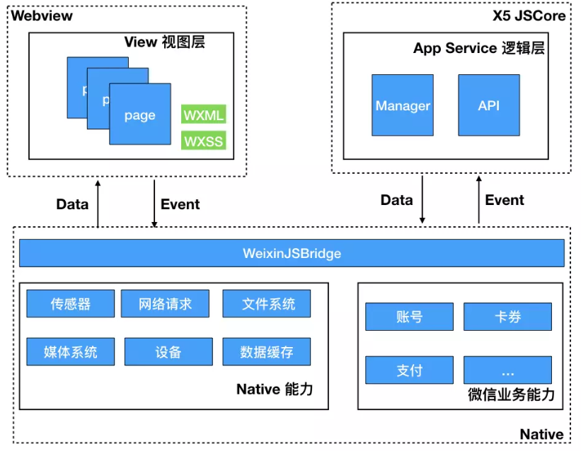
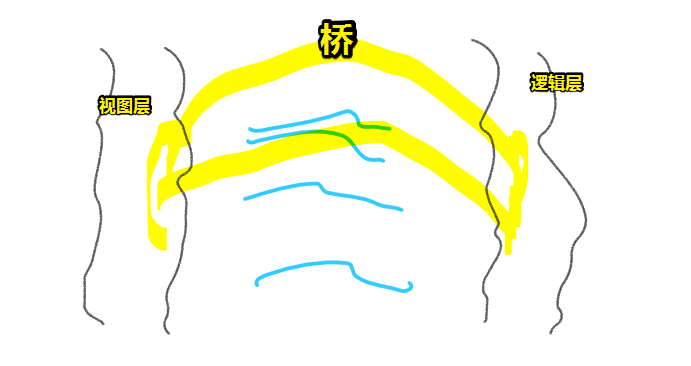
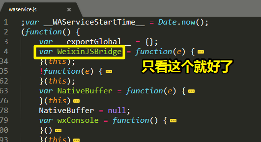
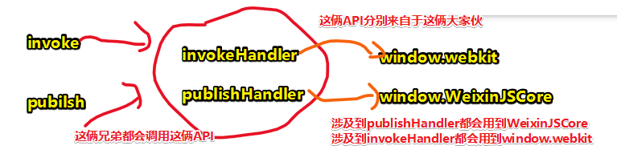
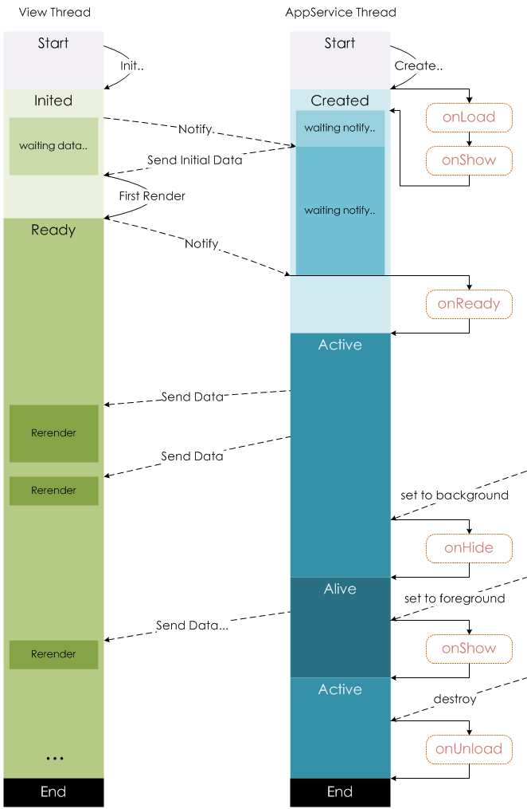
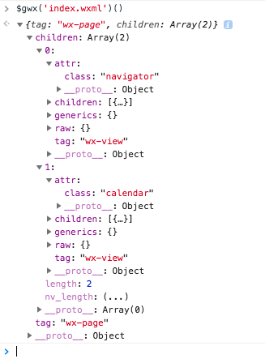
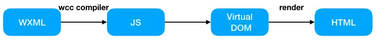

# 基础篇 3：小程序架构及其实现机制

> 这篇看得不是很懂呀！我暂且跳过这篇，然后去看看官网的介绍！

## ★小程序的常识性知识

### ◇小程序 VS HTML5

小程序并不是 HTML5 应用，而是更偏向于传统的 CS 架构，它是基于**数据驱动**的模式，**一切皆组件**（视图组件）。下面是小程序与普通 Web App 的对比。

- 普通 HTML5 都是执行在浏览器的宿主环境，浏览器提供 `window`、`document` 等 BOM 对象，但小程序没有 `window`、`document`，它更像是**一个类似 Node.js 的宿主环境**；因此在小程序内不能使用 `document.querySelector` 这类 DOM 选择器，也不支持 `XMLHttpRequest`、`location`、`localStorage` 等这些浏览器提供的 API，**只能使用小程序自己实现的 API**
- 小程序**并非是直接通过 URL 访问**的，而是**通过信道服务进行通信和会话管理**，所以它**不支持 Cookie 存储**，同时访问资源使用 `wx.request` 则**不存在跨域的问题**
- 小程序在 JavaScript 的**模块化上支持 CommonJS，通过 require 加载，跟 Node.js 类似**
- 小程序的页面样式**完全继承了 CSS 的语法**，但是在**选择器上面会少一些**，布局**支持 flex 布局**
- 小程序的整体框架采用**面向状态编程方式**，状态管理从 API 来看采用**类似 Redux 的设计方式**；**单向数据绑定方式**，当 View 在 Action 操作后，只能通过 Action 的业务处理来更新 View

页面组件模块上，WXML 提供了一整套的「**自定义 UI 组件标签**」，有些组件实际是 HTML5 实现的，有些组件为了解决权限、性能和适配等问题实际是 Native 实现的（如 map、input、canvas、video）。

## ★小程序架构解密



小程序架构如上图所示，分为**视图层和逻辑层**，视图层是在 WebView 内渲染，逻辑层则有 JavaScriptCore 来渲染；其中视图层可以多个（考虑到整体性能，**最多可以 5 个**），逻辑层则**全局只有一个**（实际通过**开启 X5 内核**另起一个 JavascriptCore 线程）。

::: tip

目前，在 Android 上，新版本，小程序逻辑层的 javascript 代码运行在 [V8](https://developers.google.com/v8/) 中，视图层是由自研 XWeb 引擎基于 Mobile Chrome 67 内核来渲染的；

**➹：**[小程序的运行环境 | 微信开放文档](https://developers.weixin.qq.com/miniprogram/dev/framework/runtime/env.html)

:::

**视图层和逻辑层的职责：**

> 在小程序内，视图层负责页面渲染，逻辑层负责逻辑处理、全局状态管理、请求和接口调用。逻辑层在小程序中称为 `APP Service`，视图层称为 `View`。

**它们俩的通信：**

> 逻辑层和视图层通过微信的 `JSBridge` 来实现通信的，逻辑层数据变化通过 `JSBridge` 通知视图层，触发视图层更新；当视图层触发事件，则继续通过 `JSBridge` 将事件通知到逻辑层做处理，如此交互进行。



::: tip

[Bridge](http://dict.cn/Bridge)：「桥梁；纽带；」

在桥上行走的只有两种人，那就是男人和女人，即`Data` 和 `Event`；逻辑层那边走来了 `Data`，视图层那边则走来了 `Event`

:::

**`JSBridge` 的实现机制：**

> `JSBridge` 在三个环境（开发者工具、iOS 和 Android）中实现机制不同。

在**调用 Native 能力**时主要使用 `invokeHandler`：

- 开发者工具：通过 `window.postMessage` 来封装
- iOS：通过 WKWebview 的 `window.webkit.messageHandlers.invokeHandler.postMessage`
- Android：通过 `WeixinJSCore.invokeHandler`

在**消息分发**的时候，则使用 `publishHandler`：

- 开发者工具：通过 `addEventListener('message')` 来监听消息，然后处理分发
- iOS：使用 WKWebview 的 `window.webkit.messageHandlers.publishHandler.postMessage`
- Android：通过 `WeixinJSCore.publishHandler`

其中，Android 的 `WeixinJSCore` 是 X5 内核暴露出来的对象，其作为 `window` 对象的一个属性，提供一些供 JavaScript 调用的能力。

这部分内容的证据可以在开发者工具或者 X5 内核 debug 模式下，找到 `WAService.js`，当然，为了方便起见你看这个[Gist](https://gist.github.com/ksky521/590fdffcff203ee9fa83cb188b4a664b)就可以了。（最好下载下来，因为这有37836行）

::: tip

在看一些源码的时候，可以使用 VS Code 或者 Sublime Text 提供的折叠功能去查看，先看个大概结构，然后再有目的的去看

:::



WeixinJSBridge 提供的方法有 `invoke`、`publish` 和 `subscribe` 等，`invoke` 就是关键的调用 Native 端能力的方法，`publish` 是消息分发的方法。



假如打开了多个 webview，如何保证逻辑层传过来的 `Data`是给哪个 webview 的？

> 由于在一个小程序里边可以打开多个视图层（webview），为了保证发送的消息准确送到每个具体的 webview 中，需要通过每个 webview 唯一标识 `webviewId` 来实现。发送消息时，携带 `webviewId`，然后逻辑层处理完对应的逻辑，如果需要通知或者执行对应 webview 的代码，则可以通过 `webviewId` 找到对应的 webview，下发通知。


## ★小程序生命周期

小程序生命周期包括应用的生命周期（逻辑层 App Service）和页面的生命周期（视图层 View），两者支持的事件不同，详见官方文档中的这张配图。



掌握了上面小程序实现原理的内容，再来看小程序的生命周期就很好理解了。

小程序启动时，会**同时启动**两个线程，一个负责页面渲染的 WebView（实际不止一个，后面讲解），一个负责逻辑的 JavaScriptCore。逻辑层初始化后会将初始化数据（app.js 中的 global data）通过 JSBridge 传递给渲染层进行渲染，渲染层 WebView 页面渲染完之后又会跟逻辑层通信。

**理解了小程序架构和启动流程，小程序整个生命周期的流程只需要对着上面的流程图就可以很容易理解。**

## ★小程序为什么感觉快

> 小程序在体验上不仅仅页面流畅，而且点击之后，页面跳转也会比普通的 HTML5 要快很多，这是因为小程序的**视图层做了预加载处理**。即当你用小程序选择今日头条，打开了两个页面（热点新闻列表和某条新闻详情），但实际在 Chrome 中看到的 WebView 页面总是**比真实打开的页面要多一个**，这个**多出来的隐藏 WebView 就是提前初始化预热的，方便打开下一个小程序页面来使用，这样就节省了 WebView 初始化的时间，从而大幅提升了跳页效率。**

## ★小程序 WXML 是怎么转成 HTML 的

小程序的视图层最终是渲染在一个 webview 中的，我们在 WXML 中写的 `view`、`icon`、`text` 等标签最终会转换成 `wx-*` 等标签。

**那么 WXML 到 HTML 的过程发生了什么呢？**

①WXML 写完之后经过编译工具 `wcc` 转成可执行的 JS，下面的命令可以将某个页面转为 JS：

```bash
wcc -d index.wxml -o index.js
```

::: tip

直接用 Everything 这个工具搜索目录「WeappVendor」即可找到 `wcc`（wxml compiler）和 `wcsc`（wxss compiler） 这两个可执行程序工具

:::

②编译好的这个 JS 里面有个重要的函数是 `$gwx`，而这个 JS 主要接收一个 `path` 将 `path` 的页面转换成一个 Virtual DOM：



在这个 VDOM 结构里面就会找到以`wx-*` 开头的 tag，**有了这个 VDOM 结构，就可以使用对应的 tag 创建 HTML 片段了。**

总之，整个流程梳理如下：



## ★小结

本节重点介绍了**小程序和普通的 HTML5 有什么区别**，从小程序底层机制上来说明**小程序是如何最终展现在 WebView 界面上的**。本节涉及较多的源码和反编译技巧，对于初学者来说**只需要了解微信小程序由逻辑层和视图层两个不同的线程进行交互而形成**，而**视图层是通过将 WXML 转换成 JS，最终由 JS 生成 HTML 片段放在 WebView 中显示的**。

## ★Q&A

### ①WebView？

我发觉自己对移动端开发确实缺少一些常识性的知识啊！比如最基础的 WebView 是啥我也不知道。

关于 WebView 的概念：

> 作为Android开发者，我们都知道在手机中内置了**一款高性能 webkit 内核浏览器**，在 SDK 中封装为一个叫做 WebView 组件。

它是一个封装好的组件，提供了某些功能，但具体是啥功能，我目前还未知晓。（既然是功能，那么就会提供有API供我们来调用它）

在[小程序官方文档](https://developers.weixin.qq.com/miniprogram/dev/framework/quickstart/framework.html#%E6%B8%B2%E6%9F%93%E5%B1%82%E5%92%8C%E9%80%BB%E8%BE%91%E5%B1%82)里边有这样一段描述：

> 小程序的运行环境分成渲染层和逻辑层，其中 WXML 模板和 WXSS 样式工作在渲染层，JS 脚本工作在逻辑层。
>
> 小程序的渲染层和逻辑层分别由2个线程管理：渲染层的界面**使用了WebView 进行渲染**；逻辑层采用JsCore线程运行JS脚本。一个小程序存在多个界面，所以渲染层**存在多个WebView线程**，这两个线程的通信会经由微信客户端（下文中也会采用Native来代指微信客户端）做中转，逻辑层发送网络请求也经由Native转发，小程序的通信模型下图所示。


可以看到，WebView 是用来渲染页面的，在浏览器里边，是使用渲染引擎来进行渲染的！所以，没有在移动端 没有 WebView 就无法看到页面。

WebView有版本之分，你在不同地方（微信里边、QQ浏览器、手机原生内置的浏览器等等）打开这个网址<http://liulanmi.com/labs/core.html> 会看到不同的或相同的版本号

而版本号越高显然功能越牛逼啊！对页面的渲染也会越好！（我能否理解成IE8、IE9这样的概念？因为我在看同一个页面的时候，在QQ浏览器上看要比在微信里边看要好，可这不是内核的问题吗？而内核的问题似乎又会决定 WebView的功能……）

暂且打住，我得找个时间看看极客时间推出的 [浏览器工作原理与实践](http://gk.link/a/107uK) 这门课程了。

**➹：**[深入讲解WebView——上|开源实验室](https://www.kymjs.com/code/2015/05/03/01/)

**➹：**[关于Android WebView的那些事 - 简书](https://www.jianshu.com/p/8826b65dd880)

**➹：**[★手机速度大提升！浏览器内核WebView升级指南 - 哔哩哔哩](https://www.bilibili.com/read/cv1172431/)

### ②Web Socket？

> [WebSocket](http://websocket.org/) 是一种网络通信协议，很多高级功能都需要它。

在上边的图中，微信客户端（小程序的宿主环境），搞了一个 「HTTPS Request」，而第三方服务器响应回来的不是「HTTPS Response」，而是「Web Socket」

那么这个「Web Socket」到底是个什么东东呢？

了解它是什么，只需要知道它的最大特点即可：

> 它的最大特点就是，**服务器可以主动向客户端推送信息**，客户端也可以主动向服务器发送信息，是真正的双向平等对话，属于[服务器推送技术](https://en.wikipedia.org/wiki/Push_technology)的一种。

它为啥会出现？（场景：服务器主动向客户端推送今天的天气状况）

- HTTP 协议做不到服务器主动向客户端推送信息，如果要推送，就得用「轮询」这种效率低下的方式

于是工程师们一直在思考，有没有更好的方法，而WebSocket 就是这样发明的。

**➹：**[WebSocket 教程 - 阮一峰的网络日志](http://www.ruanyifeng.com/blog/2017/05/websocket.html)

### ③调试小程序的？

**➹：**[腾讯浏览服务-调试工具](https://x5.tencent.com/tbs/guide/debug/season1.html)

**➹：**[微信小程序开发入门：从 0 到 1 实现天气小程序 - 三水清 - 掘金小册](https://juejin.im/book/5b70f101e51d456669381803/section/5b70f888f265da27e36ef112)


