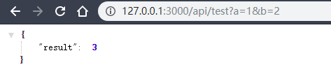

# 实战篇 1：小程序开发环境搭建

> 这一节我是怎么看的？——把这个[小程序项目](https://github.com/ksky521/fresh-weather)跑起来，然后看看Gulp这个构建工具是怎么搞事情的！
>
> 使用原生姿势开发小程序，没有用到**Taro**（熟悉React）、**mpvue**（熟悉Vue.js）这样的小程序开发框架。
>
> 我们本地开发主要关注的是 `client`目录，而`dist`目录则是作为项目导入到微信开发者工具里边的！

## ★技术选型

- VS Code： 编辑器，用于代码编写
- Gulp：前端项目构建工具
- Sass：小程序样式表
- ES6：采用 ES6 语法编写 JS 代码，Babel 做编译处理

## ★添加 gulp task

> 开发配置

### ◇wxml task

`wxml` 语法实际就是 `html` 的语法，不需要做额外的处理，直接 release 到**目标目录**即可：

```js
function wxml() {
  return src(`${client}/**/*.wxml`).pipe(dest(dist))
}
```

> 把 `client`目录下所有的的 `.wxml`文件，copy到 `dist` 目录下，需要注意的是，这拷贝是会带着目录的，并不是仅仅把所有的 `.wxml`文件直接拷贝到`dist`目录的根里边！说白了，`.wxml`文件在 `client`目录里边是怎么个嵌套法，那么在 `dist`目录同样是这么个嵌套法！

### ◇wxss task

```js
const { src, dest } = require('gulp')
const rename = require('gulp-rename')
const postcss = require('gulp-postcss')
const pxtorpx = require('postcss-px2rpx')
const base64 = require('postcss-font-base64')
const combiner = require('stream-combiner2')

function wxss() {
  const combined = combiner.obj([
    src(`${client}/**/*.{wxss,scss}`),
    sass().on('error', sass.logError),
    postcss([pxtorpx(), base64()]),
    rename(path => (path.extname = '.wxss')),
    dest(dist)
  ])
  combined.on('error', handleError)
  return combined
}
```

> 可以不使用 CSS 的自动添加浏览器兼容前缀的 `autoprefixer` 插件，而直接用小程序开发者工具的「详情 -> 项目设置 -> 上传代码时样式自动补全」功能。

### ◇js task

> 微信的 js 文件使用的是 ES5 语法，为了更好的开发体验，小册作者在开发中使用了 ES6/7 语法，因此，在 Gulp 编译时引入了 `babel` 插件对 js 进行编译，并且还引入了 `sourcemap` 以方便本地 debug 代码。

安装Babel：

```js
yarn add -D gulp-babel @babel/core @babel/preset-env 
```

配置 `.babelrc`

```js
{
  "presets": [
    "@babel/preset-env"
  ]
}
```

task：

```js
const babel = require('gulp-babel')
const sourcemaps = require('gulp-sourcemaps')

async function js() {
  return await src(`${client}/**/*.js`)
    .pipe(sourcemaps.init())
    .pipe(babel({
      presets: ['@babel/preset-env']
    }))
    .pipe(sourcemaps.write('./'))
    .pipe(dest(dist))
}
```

::: tip

关于`babel({presets: ['@babel/preset-env'] })`，如果你配置了 `.babelrc`，那么直接 `babel()`就可以了，不然，就得写上！

总之，最好还是配置个 `.babelrc`，因为好维护呀！

:::

**➹：**[babel/gulp-babel: Gulp plugin for Babel](https://github.com/babel/gulp-babel)

**➹：**[babel 升级到7.X采坑总结 - 个人文章 - SegmentFault 思否](https://segmentfault.com/a/1190000016458913)

**➹：**[Usage Guide · Babel](https://babeljs.io/docs/en/usage)

**➹：**[babel-preset-env使用指南 - 程序猿小卡 - 博客园](https://www.cnblogs.com/chyingp/p/understanding-babel-preset-env.html)

### ◇其它 task

> 对于 `json`、`images` 和 `wxs` 类文件，主要采取的方式是按照当前路径复制到**目标目录**，所以它们的 task 配置是：

```js
function json() {
  return src(`${client}/**/*.json`).pipe(dest(dist))
}
function images() {
  return src(`${client}/images/**`).pipe(dest(`${dist}/images`))
}
function wxs() {
  return src(`${client}/**/*.wxs`).pipe(dest(dist))
}
```

## ★生产发布打包配置

- 增加了对资源的压缩（js、html、json、css）
- 需要打扫战场，即把生成的dist目录给删了，然后再生产发布打包

### ◇js task

> 压缩（微信开发者工具已经提供了，可以不做），不生成sourcemap。

打扫战场：

```js
function clean() {
  return del(['./dist/**'])
}
```

压缩并去掉sourcemap：

```js
async function prodJS() {
  return await src(`${client}/**/*.js`)
    .pipe(babel())
    .pipe(uglify({
      compress: true
    }))
    .pipe(sourcemaps.write('./'))
    .pipe(dest(dist))
}
```

### ◇wxss task

> 使用[cssnano](https://github.com/ben-eb/gulp-cssnano)压缩它！
>
> **➹：**[使用cssnano来压缩和优化你的css · Issue #159 · iuap-design/blog](https://github.com/iuap-design/blog/issues/159)

```js
function prodCSS() {
  const combined = combiner.obj([
    src(`${client}/**/*.{wxss,scss}`),
    sass().on('error', sass.logError),
    postcss([pxtorpx(), base64()]),
    cssnano({
      autoprefixer: false,
      discardComments: { removeAll: true }
    }),
    rename(path => (path.extname = '.wxss')),
    dest(dist)
  ])
  combined.on('error', handleError)
  return combined
}
```

> cssnano还有很多特性，讲真，根据不同的特性，组合起来，真得可以玩出花来！不过，我只需要看小册作者怎么做就好了，关于前端工程化，我真得了解不多呀！
>
> **➹：**[前端构建工具是什么？ - 知乎](https://www.zhihu.com/question/35595198)

### ◇json task

> 压缩json文件吗，使用的模块是 [jsonminify](https://github.com/tcarlsen/gulp-jsonminify)，而该模块的作用是：
>
> **通过移除所有空白和注释，将类似JSON的内容块缩小为有效的JSON。**

### ◇wxml task

> 这个就不压缩了！ 或许是因为压缩HTML并不好吧！

## ★添加 watch task

> 更新xxx文件，然后保存，即可更新`dist`目录下的 xxx 文件

```js
async function watch() {
  ;['wxml', 'wxss', 'js', 'json', 'wxs'].forEach(v => {
    gulp.watch(`${client}/**/*.${v}`, series(eval(v)))
  })
  gulp.watch(`${client}/images/**`, series(images))
  gulp.watch(`${client}/**/*.scss`, series(wxss))
}
```

::: tip

series接收的值是变量。以防`watch`这个名字冲突，就不全局引入 `watch`了，直接用 `gulp.watch`即可！

gulp4.x之后，`watch`的**第二个参数必须为函数**

上边的代码，其实并不需要加 `series`，在这里，只是为了告知，可以关联一个任务组合。

:::

## ★mock server实现

**为什么需要？**

> 小程序云函数的联调测试是相当麻烦的，每次修改代码，都需要跑到小程序开发者工具的编辑器中，选择云函数文件夹「上传并部署」，而这样的开发效率显然是十分低的。

**是什么？**

> 这是一套云函数本地 mock 的方法，使用 mock server 可以在本地开发的时候直接使用 `wx.request` 方法调用 mock server 的接口，而真正上线的时候（或者发布测试的时候），则使用 `wx.cloud.callFunction` 方式调用。

**mock server 的职责：**

- 本地开发时，**将云函数代理到 localserver**，免除每次上传云函数测试效果的低效率研发方式
- 要设计一套方案，**将云函数文件单独提取出来**，做到 mock server 和上线后代码统一，不做二次开发（修改），降低开发成本
- 把将来放到服务器管理的静态资源（如图片 icon 类等）暂时放到**本地托管**，方便本地开发使用

基于上面的职责，将小程序项目结构调整如下：

```
├── README.md
├── client                    // 小程序 client 部分，主要编写内容
│   ├── app.js
│   ├── app.json
│   ├── app.scss
│   ├── project.config.json  // 小程序项目配置，如云函数文件夹
│   ├── components           // 组件
│   ├── images               // 图片资源
│   ├── lib
│   │   ├── api-mock.js      // api-mock 功能，详见文档「云函数 mock」部分
│   │   ├── api.js           // 实际 api
│   │   ├── bluebird.js
│   │   └── util.js
│   └── pages
│       └── index
├── config.server.json
├── dist
├── gulpfile.js
├── package.json
├── server                   // 小程序 server 部分，主要是静态资源和云函数
│   ├── cloud-functions
│   │   ├── test
│   │   └── test2
│   ├── index.js
│   ├── inline               // 云函数公共模块，打包的时候会 inline 进引入的云函数
│   │   └── utils.js
│   └── static
│       └── gulp.png
└── test                     // 测试文件夹
    └── functions            // 存储小程序云函数测试用的参数模板
        └── test.json
```

主要变化如下：

1. 跟**前端相关的文件都放入了 client** 中，编译后放到 dist 目录中，小程序开发者工具开发目录选择 dist 文件夹
2. 跟 **mock server 相关的**放入 server 中，server 下文件**不做打包处理**，即不 release 到 dist 文件下
3. 其中 **server/cloud-functions 是云函数文件夹**，编译之后放到 dist/cloud-functions 下
4. server/static 文件夹是**静态资源文件夹**，将来上传到小程序云开发的「文件管理」中维护（小程序云开发 CDN 静态资源服务器）

### ◇使用 Express 来实现 mock server

> 使用 [Express](https://link.juejin.im/?target=https%3A%2F%2Fwww.express.com%2F) 来在本地实现一个 mock server

**①在 `server`的`index.js`里边，添加以下代码：**

```js
const express = require('express')
const path = require('path')

const { PORT } = require('../config.server.json')
const app = express()

app.listen(PORT, () => {
  console.log(`开发服务器启动成功：http://127.0.0.1:${PORT}`)
})

//实现静态资源服务
//使用 express.static 将 server/static 目录设置为静态资源服务器：

//添加static
app.use(
  '/static',
  express.static(path.join(__dirname, 'static'), {
    index: false,
    maxage: '30d'
  })
)

//实现云函数服务

//测试「tes」这个云函数，require的结果是index.js这个文件，而这个文件的main变量正是暴露给其它模块使用的
const test = require('./cloud-functions/test/').main

app.get('/api/test', (req, res, next) => {
  console.log(req.query) //{ a: '1', b: '2' }
  // 将 req.query 传入,云函数返回的是个promise对象，把返回结果经由res log到页面里边，话说then的参数难道不是函数吗？
  test(req.query).then(res.json.bind(res)).catch((e) => {
    console.error(e)
    next(e)
  })
  // next()
})

```

**②在 `server/cloud-functions/test`里边添加个`index.js`文件，并往里边搞点内容：**

```js
exports.main = async (event) => {
  let { a, b } = event
  return new Promise((resolve, reject) => {
    resolve({ result: parseInt(a) + parseInt(b) })
  })
}

```

**③在项目的根目录的 `config.server.json`里边添加以下内容：**

```js
{
  "PORT": 3000,
  "SERVER_URL": "http://127.0.0.1:3000",
  "BACKGROUND_PATH": "./tatic/bg",
  "WEATHER_IMAGE_PATH": "./static/icon"
}
```

**④测试**

```bash
# 访问静态资源：
http://127.0.0.1:3000/static/bg/day/clear.jpg

# 测试「test」这个云函数
http://127.0.0.1:3000/api/test?a=1&b=2
```



### ◇使用 nodemon 对 server 进行自动重启

**为什么需要？**

> 在云函数开发中，当文件改动了，需要重启 Node.js 服务，如果每次都手动操作就太消耗时间和精力了，所以引入了 [nodemon](https://github.com/remy/nodemon#nodemon) 对 server 目录下文件进行监控，发现文件修改，则重启 Node.js 服务。

nodemon 的重启命令放在 `package.json` 中维护：

```json
// 启动
"scripts": {
  "server": "nodemon ./server/index.js"
},
// nodemon 配置
"nodemonConfig": {
  "ignore": ["test/*", "book/*", "client/*", "bin/*", "node_modules", "dist/*", "package.json"],
  "delay": "1000"
},
```

::: tip

json文件里边不存在注释

:::

效果如图所示：


> 这简直就是gulp的watch哈！

### ◇添加 cloud task

```js
// cloud-functions 处理方法
const cloudPath = './server/cloud-functions'
function cloud() {
  return src(`${cloudPath}/**`).pipe(dest(`${dist}/cloud-functions`))
}

// 云函数有文件变动，那就重新拷贝一份到dist目录的cloud-functions里边去
async function watchCloud() {
  gulp.watch(`${cloudPath}/**`, cloud)
}

exports.devCloud = series(cloud, watchCloud)
```


## ★前端对云函数的调用

**为什么需要？**

> mock server 中的云函数实现了一套代码在本地和线上都可以跑通，但是 `client` 中页面引用云函数使用 `wx.cloud.callFunction` 却不能实现一套代码通用

为解决这个问题，小册作者通过 `jdists` 的 `remove` 和 `trigger` 方式来实现差异化管理

不过，我就没搞了！因为就只需要写几个云函数而已！

## ★总结

- 关于gulp的配置，需要配置开发环境和生产环境，配置环境的关键在于，你得知道你的开发目录下有哪些类型的文件，而根据不同类型的文件，需要做出怎样的处理，我直接看得是小册作者做的处理，毕竟我也没有接触过，之前都是用webpack直接搞，然后打包就直接上线了。
- 这小程序用的都是开发依赖啊！
- 搞项目时要运行一些脚本呢：
  - 如果`dist`目录啥内容都咩有，那就 `yarn dev`
  - 如果`dist`目录已经有内容了，那就 `yarn start`；
  - 如果你要处理云文件，那就 `yarn cloud`；
  - 如果你要本地测试云函数，那就 `yarn server`
  - 如果你要打包上线，那就 `yarn build`
- 关于本地测试云函数，官方提供了一个工具 [SCF-Cli](https://github.com/TencentCloud/scf-node-debug)。至此，云函数的修改就不需要每次都上传到云端之后再测试了，可以提高研发效率。

## ★Q&A

### ①Gulp？

它是干嘛的？

> 用自动化构建工具增强你的工作流程，即 gulp 将开发流程中**让人痛苦或耗时的任务自动化**，从而**减少你所浪费的时间、创造更大价值**。

快速入门：

1. 安装 gulp 命令行工具

```bash
yarn global add gulp-cli
```

2. 进入xxx项目，`yarn init`
3. 安装 gulp，作为开发时依赖项

```bash
yarn add gulp --dev
```

4. 检查 gulp 版本

```bash
gulp -v
```

5. 在项目的根目录下创建一个名为 `gulpfile.js` 的文件，并在文件中输入以下内容：

```js
function defaultTask(cb) {
  // place code for your default task here
  cb();
  //console.log(1)
}

exports.default = defaultTask
```

6. 测试，在项目根目录下执行 gulp 命令： `gulp`。如需运行多个任务（task），可以执行 `gulp <task> <othertask>`。
7. 输出结果。默认任务（task）将执行，因为任务为空，因此没有实际动作。

**➹：**[快速入门 · gulp.js 中文文档](https://www.gulpjs.com.cn/docs/getting-started/quick-start/)

**➹：**[从 npm 迁移 | Yarn](https://yarnpkg.com/lang/zh-hans/docs/migrating-from-npm/)

**➹：**[Gulp：任务自动管理工具 -- JavaScript 标准参考教程（alpha）](https://javascript.ruanyifeng.com/tool/gulp.html)

### ②递归创建目录？

有两种姿势：

```bash
mkdir -p d/a/b/c
npx mkdirp src/test/a/b/v
```

有了npx，不需要我们在本地安装`mkdirp`这个包了，因为npx可以远程使用包，不过就是太慢了！

关于 `mkdirp`这个包：
该包只提供一个方法：`mkdirp(pathName, function(err){})`

```js
const mkdirp = require('mkdirp');
mkdirp('./tmp/foo/bar/baz', function (err) { // 在当前目录下创建多级文件夹
  console.log(err);
});
```

**➹：**[Node模块--mkdirp - 个人文章 - SegmentFault 思否](https://segmentfault.com/a/1190000011832060)

### ③ `.prettierrc`是个啥文件？

> prettier是一款固执己见（顽固坚持自己的意见。）的代码格式化工具，它几乎移除了编辑器本身所有的对代码的操作格式，然后重新显示。就是为了让所有用这套规则的人有完全相同的代码。**在团队协作开发的时候更是体现出它的优势**。与eslint，tslint等各种格式化工具不同的是，prettier只关心代码格式化，而不关心语法问题。

使用该文件意味着，不需要在vscode 里边安装该插件了。

**➹：**[Prettier · Opinionated Code Formatter](https://prettier.io/)

**➹：**[感受一下神奇的 Prettier](https://blog.feddy.org/prettier-tutorial/)

**➹：**[超人气代码格式化工具prettier - 掘金](https://juejin.im/post/5cc58039f265da03775c5a6f)

**➹：**[.Prettierrc文件的设置 - 掘金](https://juejin.im/post/5a7d70496fb9a063317c47f1)

**➹：**[.prettierrc文件常见配置 - onlyliii的博客 - CSDN博客](https://blog.csdn.net/onlyliii/article/details/89312857)

### ④ `rc`后缀为何意？

**run commands** 之意。说白了这个文件里边的内容是要被运行的。

**➹：**[linux - What does the 'rc' in `.bashrc`, etc. mean? - Super User](https://superuser.com/questions/173165/what-does-the-rc-in-bashrc-etc-mean)

### ⑤ `.editorconfig`？

> 该文件是不是有点多余？因为我用了 `.prettierrc`

它是什么？

> 官网说：`editorconfig`帮助开发人员在不同的编辑器和ide之间定义和维护一致的编码风格。

**总之，简单来说就是跨编辑器使用同一份代码缩进等配置**

不过，要让该文件生效的话，需要安装「EditorConfig for VS Code」插件。而webstorm就不需要了，因为它内置了，所以你在切换到IDE开发时就不需要安装该插件了，而在vscode里边，就得需要安装！

**➹：**[★项目代码规范工作流——editor、prettier、eslint、git-check | Jsonz1993](https://jsonz1993.github.io/2018/03/%E9%A1%B9%E7%9B%AE%E4%BB%A3%E7%A0%81%E8%A7%84%E8%8C%83%E5%B7%A5%E4%BD%9C%E6%B5%81%E2%80%94%E2%80%94editor%E3%80%81prettier%E3%80%81eslint%E3%80%81git-check/)

**➹：**[快速用上 editorconfig 来规范编辑 - 掘金](https://juejin.im/post/5b9cba4c6fb9a05cf67a79a4)

**➹：**[【译】EditorConfig 介绍 | AlloyTeam](http://www.alloyteam.com/2014/12/editor-config/)

**➹：**[★前端综合能力系列之EditorConfig - 掘金](https://juejin.im/post/5ad05a085188257cc20db392)

### ⑥ `.wxs`是个怎样的文件？

WXS（WeiXin Script）是小程序的一套脚本语言，结合 `WXML`，可以构建出页面的结构。

WXS 与 JavaScript 是不同的语言，**有自己的语法，并不和 JavaScript 一致**。

**➹：**[WXS 语法参考 | 微信开放文档](https://developers.weixin.qq.com/miniprogram/dev/reference/wxs/)

### ⑦WebFont？

WebFont 技术可以让网页使用在线字体

通过 CSS 的 `@font-face` 语句引入在线字体，使用 CSS 选择器指定运用字体的文本

**➹：**[迟到的中文 WebFont - w3ctech](https://www.w3ctech.com/topic/669)

**➹：**[特色功能-有字库](https://www.webfont.com/introduce/index.html)

**➹：**[★网页字体优化  |  Web Fundamentals  |  Google Developers](https://developers.google.com/web/fundamentals/performance/optimizing-content-efficiency/webfont-optimization?hl=zh-cn)

**➹：**[itgalaxy/webfont: Awesome generator of webfont](https://github.com/itgalaxy/webfont)

**➹：**[★Iconfont-webfont平台](https://www.iconfont.cn/webfont?spm=a313x.7781069.1998910419.d81ec59f2#!/webfont/index)

### ⑧如何同时安装多个依赖？

> 在用gulp搭建小程序开发中需要安装很多个依赖

```bash
yarn add -D gulp-rename
yarn add gulp-postcss postcss-px2rpx --dev
yarn add postcss-font-base64 stream-combiner2 --dev
```

### ⑨`stream-combiner2`？

> 把一系列的流合并成一条小溪，从第一个元素开始执行，直到最后一个，如果其中有一个元素出错了，那么不会直接抛出，停止其它元素的执行，而是被监听器捕获，让其它元素顺利执行……
>
> 突然觉得，`pipe`就是一个元素的下标，而 传给 `pipe`的参数，就是一个元素，即一个可执行的动作

不用combiner2：

```js
async function wxss() {
  return await src(`${client}/**/*.{wxss,scss}`)
    .pipe(sass()).on('error', sass.logError)
    .pipe(postcss([pxtorpx(), base64()]))
    .pipe(rename((path) => (path.extname = '.wxss')))
    .pipe(dest(dist))
}
```

用上combiner2：

```js
const handleError = (err) => {
  console.log('\n')
  log(colors.red('Error!'))
  log('fileName: ' + colors.red(err.fileName))
  log('lineNumber: ' + colors.red(err.lineNumber))
  log('message: ' + err.message)
  log('plugin: ' + colors.yellow(err.plugin))
}
function wxss() {
  const combined = combiner.obj([
    src(`${client}/**/*.{wxss,scss}`),
    sass().on('error', sass.logError),
    postcss([pxtorpx(), base64()]),
    rename((path) => (path.extname = '.wxss')),
    dest(dist)
  ])
  combined.on('error', handleError)
  return combined
}
```

**➹：**[整合 streams 来处理错误 - gulp.js 中文文档 | gulp.js 中文网](https://v3.gulpjs.com.cn/docs/recipes/combining-streams-to-handle-errors/)

**➹：**[Using stream-combiner2 with Gulp 4 - Stack Overflow](https://stackoverflow.com/questions/46508469/using-stream-combiner2-with-gulp-4)

**➹：**[substack/stream-combiner2](https://github.com/substack/stream-combiner2)

### ⑩sass和scss？

- **Sass**，一种缩进语法
- **SCSS**，一种 CSS-like 语法

这个天气项目用的是scss。

安装依赖时，用的是 `gulp-sass`，而不是什么  `gulp-scss`之类的

**➹：**[Sass 与 SCSS 是什么关系？ - 闻醉 - SegmentFault 思否](https://segmentfault.com/a/1190000005646206)

**➹：**[SCSS 与 Sass 异同 | Sass 中文文档](http://sass.bootcss.com/docs/scss-for-sass-users/)

### ⑪不明觉厉的node模块？

- [fancy-log](https://github.com/gulpjs/fancy-log)：log一些东西，但是带有时间戳（gulp的任务运行就自带这样的时间戳）：

```js
var log = require('fancy-log');

log('a message');
// [16:27:02] a message

log.error('oh no!');
// [16:27:02] oh no!
```

**➹：**[常用gulp插件介绍(一) | 进击的马斯特](http://pinkyjie.com/2015/08/02/commonly-used-gulp-plugins-part-1/#comments)

### ⑫关于promise的then的参数不是函数？

```js
// 'bar' 不是函数，会在内部被替换为 (x) => x
p.then('bar').then((value) => {
    console.log(value) // 'foo'
})
```

所以下边这个代码的实质是：  `()=>{res.json.bind(res)}`

```js
test(req.query)
    .then(res.json.bind(res))
    .catch(e => {
      console.error(e)
      next(e)
    })
```


⑬

⑭⑮⑯⑰⑱⑲⑳