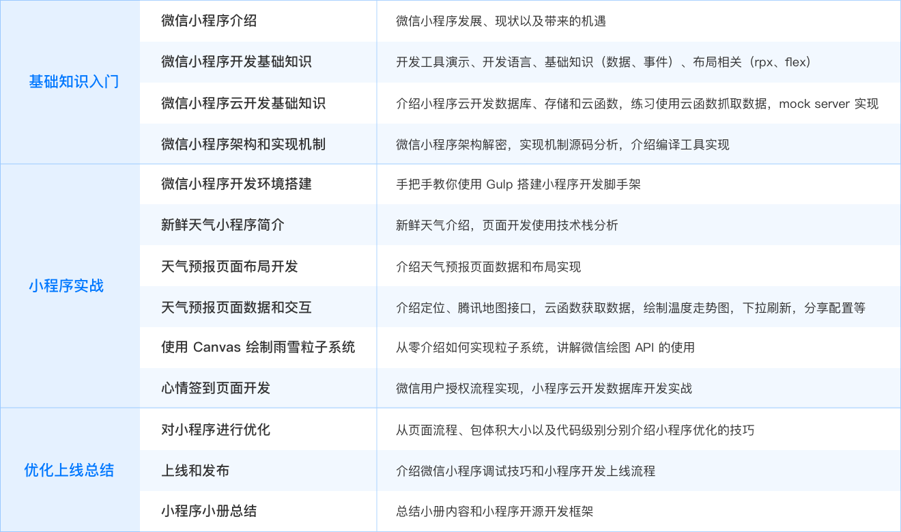

# 从 0 到 1 实现天气小程序

> 从基础到实战，从开发环境搭建到开发、调试、上线，打通小程序开发全流程

## 🎉 资源

**➹：**[微信小程序开发入门：从 0 到 1 实现天气小程序 - 三水清 - 掘金小册](https://juejin.im/book/5b70f101e51d456669381803)

## 🙋 为什么？

小程序开发已经越来越火，目前微信、支付宝、百度和小米等都已经推出了各自的小程序解决方案，**掌握小程序开发的工程师也越来越受欢迎**。小程序是微信首先提出的一套前端 Hybrid 解决方案，凭借**微信巨大的用户群和社交红利**，目前微信小程序相对其他家在技术和生态建设上都处于绝对领先阶段。作为一个研发工程师或者想从事小程序开发的互联网从业人员，想必你会十分关注：

* **如何快速上手微信小程序开发？**
* **小程序的运行机制是怎样的？**
* 微信和腾讯云最新推出的小程序·云开发又是什么？
* 怎样在微信内获取用户信息？

## 💡 课程设计思路？

基于以上问题，由浅到深，以打造一款**拥有天气预报和签到功能的**小程序为主线，从基础知识到小程序运行机制，从开发环境搭建到小程序开发、调试、上线，打通微信小程序开发全流程，目的是**让学习者更好地理解并上手小程序开发。**

## ⌛ 内容组织？

1. 小程序开发基础知识：这部分主要介绍微信小程序、小程序云开发基础知识，最后介绍了小程序的运行机制
2. 实战开发「新鲜天气」小程序：从脚手架搭建开始，将「新鲜天气」的天气预报和心情签到页面从布局到功能实现进行全面讲解，涉及小程序研发中绝大部分 API 和重要流程的梳理实现
3. 优化到上线：从多个方面介绍小程序优化的知识点，并且完成小程序的上线

## 📑 课程目录？

## 🔥 学到什么？

* **掌握小程序开发必备的基础知识**
* 从零开始完成并上线一个天气小程序
* **了解小程序的运行机制**
* 全新小程序·云开发核心功能的实际应用
* 使用 Express 实现本地 mock server
* 使用 Canvas 绘制雨雪效果的粒子系统

## 🤔 Q&A

### ①什么叫 hybrid app？

> Hybrid App（混合模式移动应用）是指介于web-app、native-app这两者之间的app，兼具“Native App良好[用户](https://baike.baidu.com/item/用户/3621489)交互体验的优势”和“Web App跨平台开发的优势”。

简单认为：hybrid app = 用户交互体验良好 + 跨平台

**➹：**[hybrid app_百度百科](https://baike.baidu.com/item/hybrid%20app)

