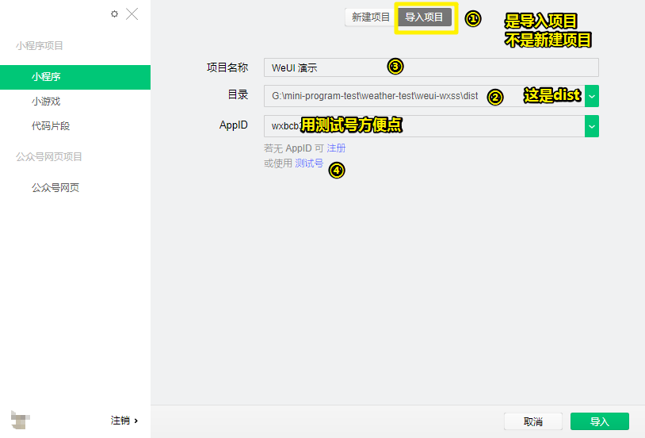
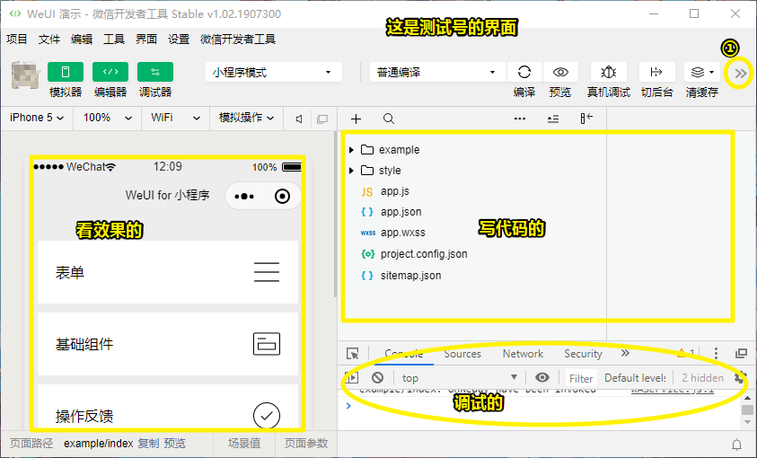
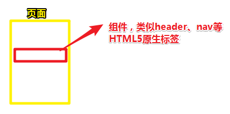
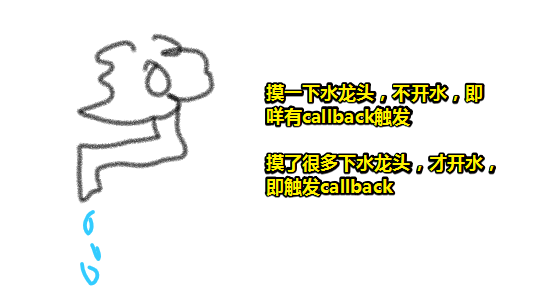
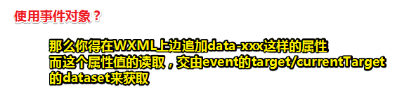
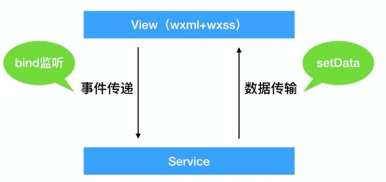

# 基础篇 1：小程序开发基础知识

## ★如何进行微信小程序开发？

微信小程序本质上是一套 Hybrid 解决方案，掌握基础 HTML5 知识的前端开发者就可以参与小程序的开发。微信小程序提供完善的开发工具链，熟悉客户端的开发者也可以快速上手小程序开发。如何快速开始小程序开发呢？分为下面几个步骤：

- 注册一个小程序开发账号
- 下载微信开发者工具
- 学习开发语言基础知识和小程序框架原理
- 学习小程序 API 的使用
- 学习小程序调试和上线操作

## ★准备工作

> 小程序开发要先注册小程序账号，有了小程序账号才可以使用开发者工具。小程序是一种特殊的开发形式，里面的 API 和组件都是自己定制的，因此在普通的浏览器中不能预览，要预览功能和页面就需要使用开发者工具。

1. 注册小程序账号：[官方文档](https://link.juejin.im/?target=https%3A%2F%2Fdevelopers.weixin.qq.com%2Fminiprogram%2Fdev%2F%23%E7%94%B3%E8%AF%B7%E5%B8%90%E5%8F%B7)
   1. 邮箱是一个没有注册过公众号的邮箱
   2. 注册号后到邮箱里边激活账号
2. 安装开发者工具：[微信开发者工具](https://link.juejin.im/?target=https%3A%2F%2Fdevelopers.weixin.qq.com%2Fminiprogram%2Fdev%2Fdevtools%2Fdownload.html)
   1. 小程序开发者工具是使用 NW.js 编写的。
   2. 作用：可以编写代码，实时查看页面和功能效果，还能在开发者工具中进行 debug。
3. 使用开发者工具演示 WeUI
   1. 是什么？——WeUI 是**一套同微信原生视觉体验一致的基础样式库**，由微信官方设计团队为微信内网页和微信小程序量身设计，令用户的使用感知更加统一。包含 button、cell、dialog、 progress、 toast、article、actionsheet、icon 等各式组件。
   2. WeUI 有两个版本，一个是[普通的 HTML5 版本](https://link.juejin.im/?target=https%3A%2F%2Fgithub.com%2FTencent%2Fweui)，另外是[小程序版本](https://link.juejin.im/?target=https%3A%2F%2Fgithub.com%2FTencent%2Fweui-wxss)。

## ★我不会用微信开发者工具？

> 通过 WeUI 来简单学习开发者工具的使用。当然，你可以把看到能点的地方都点一遍，然后看看有什么效果，这样你就学会使用它了。

**①找个合适的目录，下载 WeUI 源码**

```sh
# https 方式（推荐）
git clone https://github.com/Tencent/weui-wxss.git
# 或者 ssh 方式
git clone git@github.com:Tencent/weui-wxss.git
```

> 不知为啥要推荐https姿势，我通常是用ssh姿势，或许是我之前遇到过搭建hexo博客的坑（用https的坑），于是很反感用 https 下载。不过反正都是拿到这个 WeUI 源码，怎么下载，其实这真得没多大关系！

**②打开开发者工具，使用注册时绑定的微信账号扫码登录，然后导入项目**



点击导入，即可进入到该 WeUI 项目的开发界面。

**③介绍开发界面**

开发界面主要由三部分组成：模拟器、编辑器和调试器。如这样：



- 模拟器：**提供小程序的运行环境**，模拟小程序在手机上的界面效果
- 编辑器：简单 IDE 功能，点击左侧树形菜单可以打开多个文件直接编写保存，做到**实时预览效果**，但是开发者工具的编辑器做得比较简单，而且使用体验并不好，建议选择自己顺手的 IDE 增加 WXML 和 WXSS 的语法高亮插件等来编辑代码
- 调试器：订制版的 Chrome 开发者工具，**提供从页面结构到网络请求等多个面板支持**，会用 Chrome DevTools 就很容易上手该工具

::: warning

测试号不能使用云开发。如果不是测试号，那么就会有个「云开发」的按钮在「调试器」按钮旁边！

**➹：**[下载了最新版本怎么没有云开发工具 | 微信开放社区](https://developers.weixin.qq.com/community/develop/doc/0004c219b805309f8c573c33951000)

:::

::: tip

常用 IDE 推荐

- VS Code + [minapp 插件](https://link.juejin.im/?target=https%3A%2F%2Fmarketplace.visualstudio.com%2Fitems%3FitemName%3Dqiu8310.minapp-vscode)
- Sublime Text 3 + [Sublime wxapp 插件](https://link.juejin.im/?target=https%3A%2F%2Fgithub.com%2Fspringlong%2FSublime-wxapp%2Fblob%2Fmaster%2Fdocs%2FREADME.zh-ch.md)
- Vim + [wxapp](https://link.juejin.im/?target=https%3A%2F%2Fgithub.com%2Fchemzqm%2Fwxapp.vim)

:::

在**开发者工具的顶部还有各种操作按钮**：

左侧主要是模拟器、编辑器、调试器和小程序云开发控制台的**视图开关**，可以**控制对应视图的开启关闭**。（我用的是测试号，所以没有云开发按钮）

而中间部分是跟开发、编译、测试和上线相关的各种按钮，我们在开发和测试小程序中会经常使用，**最常用的有**：

- 预览、远程调试：是可以在手机上直接预览效果，开启远程 debug 功能的
- **清缓存**：对于一些授权登录、缓存、数据之类的操作，我们需要清理状态和数据，可以通过这个按钮操作
- 上传：如果是创建项目的时候填写了 AppID，那么会出现这个按钮，小程序开发完毕后可以通过这个来上传，上传之后可以在小程序后台申请测试版和审核，审核通过后就可以正式上线了

开发者工具右上角的「详情」：

这个东西在上图里边标注①的 `>>`里边，你点开它就可以看到一个 Tabs 标签页

它主要有三个 Tab：基本信息、本地设置和项目配置。我们主要关注的是：

- 本地设置：这个是**用得比较多**的，可以**指定上传代码时候的编译情况**，比如支持 ES6 语法、支持 css autoprefixer、代码压缩等
- 域名信息（项目配置里边的）：小程序的 `request` 等访问的域名采用了白名单形式，在这里可以看到小程序管理后台设置的域名白名单
- 腾讯云状态（这个我没有）：可以看到小程序账号和腾讯云的绑定情况

## ★写小程序，用啥开发语言？

小程序的开发语言跟前端开发者比较熟悉的 HTML5 非常相似（甚至相同），小程序的视图层由 `WXML` 和 `WXSS` 组成，分别对应 HTML（HyperText Markup Language） 和 CSS（Cascading Style Sheets），逻辑层则跟 HTML5 一样，也是 JavaScript 语言实现。

- WXML：**小程序自己发明的** XML 语法描述，用来构造小程序的页面结构
- WXSS：小程序的页面的**样式表语言**，描述 WXML 的样式
- JavaScript：小程序 JS 的执行环境并不是普通的 WebView 浏览器，也不是 Node.js 环境，它**执行在微信 App 内上下文**， 跟 Node.js 一样，也**不能像在浏览器内一样对页面 DOM 进行操作**

::: warning

微信小程序运行在三端：iOS、Android 和用于调试的开发者工具

- 在 iOS 上，小程序的 JavaScript 代码运行在 JavaScriptCore 中
- 在 Android 上，小程序的 JavaScript 代码通过 X5 内核来解析
- 在 开发工具上， 小程序的 JavaScript 代码运行在 NW.js（Chromium 内核） 中

:::

除了普通的 JavaScript，小程序还支持一种**类似 JS** 的 **WXS** 语言，**WXS 对于小程序开发不是必需的**，它的主要目的是为了**增强 WXML 的数据处理能力**而新引入一种技术实现，其**实际解析的语言规范还是 JS，并没有引入新的语法，仅仅对 JS 做了上层的封装和限制**，所以**学习上基本没什么成本**，大致了解下开发文档马上就能上手。

::: warning

对于 WXS 和 JavaScript 的性能比较，官方给出的数据是：**由于运行环境的差异，在 iOS 设备上小程序内的 WXS 会比 JavaScript 代码快 2 ~ 20 倍。在 Android 设备上二者运行效率无差异。**

:::

## ★小程序项目相关知识

### ◇小程序目录结构

小程序项目由配置文件、页面文件、静态资源和其他相关（比如组件、小程序云函数等）内容组成，一般小程序会由四类文件组成：

- `.json` 后缀的 JSON 配置文件
- `.wxml` 后缀的 WXML 模板文件
- `.wxss` 后缀的 WXSS 样式文件
- `.js` 后缀的 JS 脚本逻辑文件

小程序项目的**目录结构组成没有严格的要求**，按照前端项目的经验，一般会分为：配置、页面、静态资源、基础库、组件等多个目录，例如下面的目录结构：

```
├── app.js            小程序全局app相关js
├── app.json          小程序配置文件
├── app.wxss          小程序全局app样式
├── cloud-functions   云函数目录
│   ├── decrypt
│   ├── geocoder
│   ├── he-air
│   ├── he-weather
│   ├── jscode2session
│   └── weather
├── components        组件库
│   └── icon
├── images            图片等静态资源
│   └── cloud.jpg
├── pages             页面目录
│   ├── diary
│   └── weather
└── project.config.json  工具项目配置文件
```

当然根据不同的项目，可能目录结构不同，但是小程序必需的 `app.json` 和**页面组成**是必不可少的。另外，**在开发复杂的项目时，我们会用到开发框架或者编译工具，这时候目录结构只需要保证编译之后的目录结构符合规范即可。**

### ◇小程序的配置

小程序有三个重要的配置，分别放在三个 JSON 文件内：`project.config.json`（工具项目配置）、`app.json`（小程序配置）、`page.json`（单页面配置）

- `project.config.json`：这个是配置项目工具相关的，比如开发者工具的编译设置（是否使用 ES6 语法等）、界面设置，以及云函数相关的 `cloudfunctionRoot`，详细可以参考[项目配置文件](https://link.juejin.im/?target=https%3A%2F%2Fdevelopers.weixin.qq.com%2Fminiprogram%2Fdev%2Fdevtools%2Fprojectconfig.html)
- `app.json`：小程序的全局配置，包括了所有页面路径、界面表现、网络超时时间、底部 tab、插件等，常用的两个配置是 `window` 和 `pages`，详细配置参考[全局配置](https://link.juejin.im/?target=https%3A%2F%2Fdevelopers.weixin.qq.com%2Fminiprogram%2Fdev%2Fframework%2Fconfig.html)
- `page.json`：是相对于 `app.json` 更细粒度的单页面配置，详细参考[页面配置](https://link.juejin.im/?target=https%3A%2F%2Fdevelopers.weixin.qq.com%2Fminiprogram%2Fdev%2Fframework%2Fconfig.html%23%E9%A1%B5%E9%9D%A2%E9%85%8D%E7%BD%AE)

## ★组件和插件

> 小程序页面是**由各种组件组成的**，组件可以**类比成原生 [HTML5](https://developer.mozilla.org/zh-CN/docs/Web/Guide/HTML/HTML5/HTML5_element_list) 的标签**。



### ◇组件

小程序内部定义了很多组件，可以对应 **HTML5 的标签和基础能力**来理解，小程序的组件**根据实现不同**，可以分为 **Web 组件和 Native 组件**，Web 组件是由 **HTML5 原生 Web 组件封装的组件**，比如 `view`、`image` 等；Native 组件是为了**增强小程序的体验**，**用客户端技术实现的组件**，包括一些交互复杂、原生 Web 组件性能不高的组件，例如 `input`、`map`、`canvas`、`video` 等。

::: warning

在页面里边经常看到的 `view`和 `image`就是 Web 组件。按照我所理解的Web组件的定义应该是由 HTML5原生标签封装而成的组件呀！难道说 `canvas`等就叫做原生 Web 组件？为啥不叫做原生的 HTML5 元素呢？

总之，我就这样理解吧：

1. 对简单、性能好的 HTML5 元素封装一层之后的东东，叫Web 组件
2. 对交互复杂、性能不高的诸如 `canvas`、`video`等元素，用客户端技术自己实现一遍的，那就叫做 Native 组件。

说白了，它们都是标签，只是多了个特别点的名字，以及功能、性能方面牛逼点了。

:::

小程序一共提供 8 大类 30 多个组件：

- 视图容器：主要是实现页面布局的，对常见的布局形式进行了封装，比如滚动 sroll-view 等
- 基本内容：类似 HTML5 中内容相关的 p、em 等
- 表单相关：要比 HTML5 的 form 表单丰富一些
- 导航：类似 a 标签
- 媒体：类比 HTML5 中的 video、audio 和 img 等，但是提供更标准的界面和更丰富的 API 支持
- 画布：Native 实现的 Canvas
- 地图：结合腾讯地图数据 Native 实现的组件
- 开放能力：这部分组件偏通用和小程序业务

### ◇自定义组件

小程序本身支持很多组件，比如地图、按钮等，开发者也可以自己**做项目内公共组件**，比如我们后面实战部分会介绍做一个 icon 组件，放在 `components` 目录下面，这样此小程序的任何页面如果要使用这个 icon 公共组件，只需在自己的 `page.json` 中添加如下字段：

```json
"usingComponents": {
  "icon": "../../components/icon/index"
}
```

添加完成之后，在页面代码中就可以直接使用 `<icon>` 的 tag 了。[官方文档](https://link.juejin.im/?target=https%3A%2F%2Fdevelopers.weixin.qq.com%2Fminiprogram%2Fdev%2Fframework%2Fcustom-component%2F)有更加详细的介绍。

::: tip

`page.json`：是相对于 `app.json` 更细粒度的单页面配置

:::

### ◇插件

插件是对一组 JS 接口、自定义组件或页面的封装，用于**提供给第三方小程序调用**。简单来说，**插件是组件的升级版本**，组件只能在自己项目中使用，插件则更独立，是可以发布到全网，供其他开发者使用的。例如实战中，使用了一款日历插件，则需要在 `app.json` 中增加 `plugins` 字段：

```json
"plugins": {
  "calendar": {
    "version": "1.1.3",
    "provider": "wx92c68dae5a8bb046"
  }
}
```

如果想开发一个插件，则可以参考[官方文档](https://link.juejin.im/?target=https%3A%2F%2Fdevelopers.weixin.qq.com%2Fminiprogram%2Fdev%2Fframework%2Fplugin%2Fdevelopment.html)。

::: warning

插件与组件的区别：

- 插件可以给别人用，而组件只能自己用
- 插件比组件的个头更高

我很好奇，人家发布的UI组件库，难道也可以叫插件吗？我把「日历插件」叫成是「日历组件」是不是也可以呢？

反正，能供其它开发者使用的东西，那就叫插件吧！只能自己用的，那就叫做组件吧！

形象点来说，世界通用货币有美元、欧元、日元、英镑、澳元、人民币等，那么这些货币就是插件货币咯，而韩元等非世界通用币元则是组件货币咯！但它们本质都是具有购买力的钱啊！即它们都是组件咯！

:::

## ★小程序开发基础

> **微信小程序是由数据驱动的开发框架**，接下来主要介绍小程序开发中的基础概念和知识。

### ◇数据驱动

微信小程序是数据驱动模型，在 WXML 中可以对页面的数据进行绑定，小程序的 WXML 内使用的是 Mustache 语法，在 `{{}}` 内可以将变量名包裹起来。 例如：

```html
<view>{{ message }}</view>
```

```js
Page({
  data: {
    message: 'Hello MINA!'
  }
})
```

但是小程序不支持复杂的表达式，目前支持简单的三元、加减和逻辑判断，如果要使用形如 `{{parseInt(num)}}` 的函数调用语法，需要 `WXS` 支持：

WXML 内容：

```html
<wxs src="./demo.wxs" module="tools" />
<view>{{ tools.toNumber(num) }}</view>
```

WXS 内容：

```js
// demo.wxs
function toNumber(n){
  return parseInt(n)
}
module.exports.toNumber = toNumber
```

小程序内对页面的数据修改只能通过 `setData` 方法，不能使用直接赋值的方式 `this.data.key = value`：

```js
Page({
  data: {
    message: 'Hello MINA!'
  },
  onLoad(){
    this.setData({
      message: 'hello world~'
    })
  }
})
```

::: danger

记住：修改页面数据，只能使用 this.setData 修改！

:::

::: warning

数据驱动视图的更新呀！学过  Vue  之后，发现这很符合直觉！

这修改数据的姿势，是把这个data对象给扔到 `setData`里边修改的呀！

:::

### ◇事件绑定和处理

在小程序内，除了标准 HTML5 中遇见的 `touchstart` 等事件外，增加了 `tap` 类的事件，主要包括以下几种：

| 事件名称  | 说明                                                         |
| --------- | ------------------------------------------------------------ |
| tap       | 手指触摸后马上离开                                           |
| longpress | 手指触摸后，超过 350ms 再离开，如果指定了事件回调函数并触发了这个事件，tap 事件将不被触发 |
| longtap   | 手指触摸后，超过 350ms 再离开（推荐使用 longpress 事件代替） |




小程序内，事件的绑定是通过在 WXML 标签增加 `bind*` 属性来实现的，比如新鲜天气的生活指数，是绑定了一个 `tap` 事件，当用户点击之后，会响应对应页面 JS 的函数：

```html
<view class="life-style">
    <view class="item" wx:for="{{lifeStyle}}" data-name="{{item.name}}" data-detail="{{item.detail}}" bindtap="indexDetail">
      <view class="title">
        <icon type="{{item.icon}}"></icon>
        {{item.name}}
      </view>
      <view class="content">{{item.info}}</view>
    </view>
</view>
```

上面的代码绑定了 `tap` 事件，事件处理函数为 `indexDetail`。

#### 事件冒泡

**小程序内的事件分为可冒泡和不可冒泡的事件，除了 submit、input 之类的事件，多数是可冒泡的事件**，对于事件的绑定，除了 `bind*` 的方式，还可以通过 `catch*` 的方式来绑定，两者的区别在于：

- `bind` 不会阻止冒泡，变形写法为 `bind:*`
- `catch` 会阻止事件继续冒泡，变形写法为 `catch:*`

#### 事件捕获

小程序内，触摸类事件支持捕获阶段，**捕获是先于冒泡的触发**。绑定捕获事件，可以使用 `capture-bind`、`capture-catch`，**后者将中断捕获阶段和取消冒泡阶段**，下面是官方的示例：

> 在下面的代码中，点击 inner view 会先后调用 handleTap2、handleTap4、handleTap3、handleTap1。

```html
<view id="outer" bind:touchstart="handleTap1" capture-bind:touchstart="handleTap2">
  outer view
  <view id="inner" bind:touchstart="handleTap3" capture-bind:touchstart="handleTap4">
    inner view
  </view>
</view>
```

> 如果将上面代码中的第一个 capture-bind 改为 capture-catch，将只触发 handleTap2。

```html
<view id="outer" bind:touchstart="handleTap1" capture-catch:touchstart="handleTap2">
  outer view
  <view id="inner" bind:touchstart="handleTap3" capture-bind:touchstart="handleTap4">
    inner view
  </view>
</view>
```

关于事件的详细说明，建议阅读[官方的文档](https://link.juejin.im/?target=https%3A%2F%2Fdevelopers.weixin.qq.com%2Fminiprogram%2Fdev%2Fframework%2Fview%2Fwxml%2Fevent.html)，以获取更大的帮助。

#### 事件对象

当事件触发时，处理函数会响应，传入 `event` 对象，通过 `event` 对象可以获取事件触发时候的一些信息，包括时间戳、`detail` 等。

因为**小程序内的事件绑定都是在 WXML 中实现的，所以传递参数只能通过 WXML 上面的属性值来传递**，例如下面的代码中，`indexDetail` 处理函数需要**接收生活指数的名称和详情**，来弹出弹层提示，这时候需要在标签上增加 `data-xx` 这样的属性，`data-name` 和 `data-detail` 就是两个属性，通过这两个值，可以在 `indexDetail` 内 `event` 对象的 `target/currentTarget` 的 `dataset` 获取参数。



```html
<view class="life-style">
    <view class="item" wx:for="{{lifeStyle}}" data-name="{{item.name}}" data-detail="{{item.detail}}" bindtap="indexDetail">
      <view class="title">
        <icon type="{{item.icon}}"></icon>
        {{item.name}}
      </view>
      <view class="content">{{item.info}}</view>
    </view>
</view>
```

```js
// weather/index.js
// 响应事件的处理函数
indexDetail(e) {
  const {name, detail} = e.currentTarget.dataset
  wx.showModal({
    title: name,
    content: detail,
    showCancel: false
  })
}
```

按照官方文档，`target` 和 `currentTarget` 都有个 `dataset`，**正确获取 dataset 的姿势是使用 currentTarget 的**，但是有时候 `target` 和 `currentTarget` 的数据又是完全一样的，如果这里使用 `target` 的话，那么有时候点击会弹出弹窗，有时候不会弹出，这两者究竟是怎样的关系呢？官方的解释有点模棱两可：

- `target`：触发事件的源组件
- `currentTarget`：事件绑定的当前组件

这里小册作者做下详细解释：

- `target`：触发事件的源组件，上面的代码中，`target` 可能是 `view.title`、`view.content`、`view.item` 任意触发事件的组件
- `currentTarget`：事件绑定的当前组件，上面的代码中，只能是真正绑定了 `bindtap` 的 `view.item`

> 同原生 JS 的理解一样呀！

下面再来看下例子：

```html
<view id="outer" bindtap="handleTap1">
  outer view
  <view id="middle" catchtap="handleTap2">
    middle view
    <view id="inner" bindtap="handleTap3">
      inner view
    </view>
  </view>
</view>
```

> 点击 inner view 时，handleTap3 收到的事件对象 target 和 currentTarget 都是 inner，而 handleTap2 收到的事件对象 target 就是 inner，currentTarget 就是 middle。
>
> 由此一看，可以简单总结出来：`target` 是事件触发源头的地方，即事件开始的地方，可以冒泡到父节点触发父节点的绑定事件；而 `currentTarget` 是开发者自己绑定事件的地方，即实际的绑定事件的节点。**所以，如果绑定的事件有子节点，那么 target 不会等于 currentTarget，有可能是冒泡触发的，由此可见，获取 dataset 的时候使用 currentTarget 是靠谱的。**


### ◇小程序的事件驱动和数据绑定模型

由上面数据驱动和事件监听的处理方式可见，小程序是一套数据和事件驱动的模型，即下面的形式：



关于小程序的运行机制，在[第 4 节](https://juejin.im/book/5b70f101e51d456669381803/section/5b70f3456fb9a00986735fa3)中会有更加详细的介绍。

### ◇路由

在小程序内，不能像 HTML5 中 a 标签那样，随便跳转，也不能像 `location` 对象中对应的属性那样随意跳转，小程序提供了对应 a 标签和 `location` 对象的方法：[navigator 组件](https://link.juejin.im/?target=https%3A%2F%2Fdevelopers.weixin.qq.com%2Fminiprogram%2Fdev%2Fcomponent%2Fnavigator.html)和 [wx 中的导航相关函数](https://link.juejin.im/?target=https%3A%2F%2Fdevelopers.weixin.qq.com%2Fminiprogram%2Fdev%2Fapi%2Fui-navigate.html)。

在小程序中，路由是由路由栈来维护的，小程序的路由栈中最多维护 5 个页面，这样在 5 个页面内，小程序维护其渲染页面，可以实现快速的切换。

小程序中跳转页面可以通过下面两种方式：

1. 使用 navigator 组件：

```html
<navigator url="跳转页面URL" >跳转到新页面</navigator>
```

2. 使用 `wx` 中的导航相关函数：

```html
<view bindtap="gotoUrl">跳转页面</view>
```

```js
Page({
  gotoUrl(){
    let url = 'pages/another/url'
    wx.navigateTo({
      url
    })
  }
})
```

### ◇JavaScript 的限制和增强

**微信内的 JavaScript 相对于浏览器中的有限制也有增强，增强的部分是基于小程序 Native 端能力做的增强**，比如增强的文件操作类（相册、录音等）；除了增强，**跟 HTML5 浏览器环境最大的不同是限制部分**。

**小程序的执行环境是没有浏览器了，所以浏览器环境特有的 `window` 对象、BOM 和 DOM 等相关 API 都存在缺失（有对应的补充 API），小程序的执行环境是类似于 Node.js 的一种执行环境**。因为没有浏览器环境，所以**跟浏览器相关的操作**如 cookie、Ajax 请求（`XMLHttpRequest`）、DOM 选择器、DOM 事件、路由 history、缓存、设备信息、位置等都不存在，与之相对应的是**小程序的私有 API**，比如我们在小程序中不能使用 `XMLHttpRequest`，但是可以使用功能更加强大的 `wx.request` 方法。


## ★小程序布局相关知识

> 介绍小程序布局相关的知识。

### ◇rpx

小程序 WXSS 中使用了 rpx 这个长度单位，可以用于表示元素的宽高和边距、字体的大小等。对于习惯使用 px 或者 rem 来做页面的前端来说，这可能让人有点迷糊。rpx 是以小程序容器宽度（等于设备宽度）恒等于 `750rpx` 来做定义的。对于 iPhone 6 来说，因为 dpr 为 2，所以 iPhone 的宽度为 375px，这样在 iPhone 6 上使用 rpx 的话，换算关系为 `2rpx=1px`。根据这样的关系类推，得到官方给的表格：

| **设备**      | **rpx换算 px (屏幕宽度/750)** | **px 换算 rpx (750/屏幕宽度)** |
| ------------- | ----------------------------- | ------------------------------ |
| iPhone 5      | 1rpx = 0.42px                 | 1px = 2.34rpx                  |
| iPhone 6      | 1rpx = 0.5px                  | 1px = 2rpx                     |
| iPhone 6 Plus | 1rpx = 0.552px                | 1px = 1.81rpx                  |

看起来很麻烦，但是只需要**按照官方建议，让设计师按照 iPhone 6 的视觉稿标准出图即可，即宽度为 750px**，按照 750px 出图，那么我们写页面时直接使用测量的尺寸来设置 rpx 就行了。

::: warning

我手机的dpr是3，即pc上的1物理像素大小，在手机上实际上是3个。说白了，你在pc上写1px看到的效果，那么在手机上看到的效果就是缩小3倍的！

:::

### ◇flex 布局

在 HTML5 标准中，flex 布局可以简便、完整、响应式地实现各种页面布局，小程序作为晚于 flex 标准创建的 Hybrid 解决方案，自然在布局设计上采用了先进的 flex 布局。

关于 flex 布局相关知识，可以参考阮一峰的 [flex 布局教程：语法篇](https://link.juejin.im/?target=http%3A%2F%2Fwww.ruanyifeng.com%2Fblog%2F2015%2F07%2Fflex-grammar.html)和[★实例篇](https://link.juejin.im/?target=http%3A%2F%2Fwww.ruanyifeng.com%2Fblog%2F2015%2F07%2Fflex-examples.html)。

::: tip

阮一峰的实例篇里边的九点骰子对于理解flex很有用呀！

:::

## ★小结

从小程序账号注册说起，依次介绍了小程序开发者工具、小程序开发语言、小程序项目、开发和布局相关的基础知识，内容由浅到深，全面地帮助大家入门小程序开发。

更多微信小程序的基础知识可以参考官方文档：[简易教程](https://link.juejin.im/?target=https%3A%2F%2Fdevelopers.weixin.qq.com%2Fminiprogram%2Fdev%2Findex.html)、[框架](https://link.juejin.im/?target=https%3A%2F%2Fdevelopers.weixin.qq.com%2Fminiprogram%2Fdev%2Fframework%2FMINA.html)、[组件](https://link.juejin.im/?target=https%3A%2F%2Fdevelopers.weixin.qq.com%2Fminiprogram%2Fdev%2Fcomponent%2F)、[API](https://link.juejin.im/?target=https%3A%2F%2Fdevelopers.weixin.qq.com%2Fminiprogram%2Fdev%2Fapi%2F)。

## ★Q&A

### ①Web Components ？

**➹：**[Web Components | MDN](https://developer.mozilla.org/zh-CN/docs/Web/Web_Components)

**➹：**[你的前端框架要被Web组件取代了-InfoQ](https://www.infoq.cn/article/LlxdiogqZvvci57_ZgJm)

**➹：**[开始使用 - Widget-dev | Amaze UI](https://amazeui.clouddeep.cn/getting-started/widget-dev/)

### ②「认识人多」不等于「人脉广」？

人脉的基础是你的「被利用价值」，所以，那就花时间提高自己的个人价值。

那么你有哪些「被利用价值」呢？

1. 你的岗位权力或者个人影响力
2. 你的财力
3. 你的智慧或者专业技术能力
4. 你的个人魅力，比如长得好看、说话幽默、人格高尚
5. 你的人际关系网络
6. 你的名气
7. ……

总之，多互助，才是王道，不过个人价值是基石，毕竟没啥能力，也帮不了人家对吧！

**➹：**[金融人士该如何建立自己的人脉？ - 知乎](https://zhuanlan.zhihu.com/p/28568946)

### ③页面路径和页面栈的区别？

问题缘由：「navigator路由跳转，目前页面路径最多只能十层。」和「小程序的路由栈中最多维护 5 个页面」

答：这是页面路径最多十层，页面栈是native打开多少个webview，不是一个概念

### ④初始化失败 请使用2.2.3或以上的基础库以使用云能力，这是什么问题啊？

> 试试在开发者工具右上角点击「详情」，在「调试基础库」后里切换版本。


