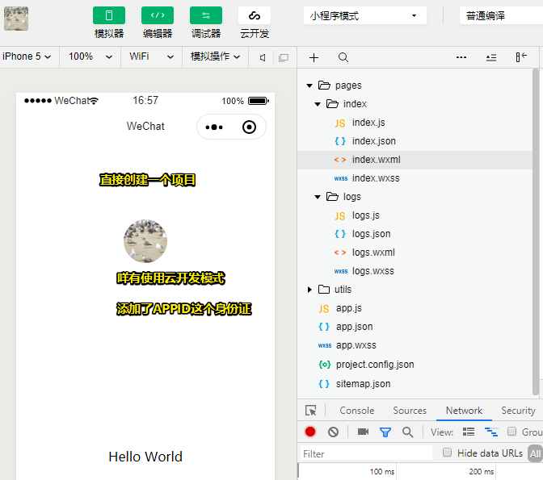

# 微信小程序开发指南

## ★资源

**➹：**[微信开放文档](https://developers.weixin.qq.com/miniprogram/dev/framework/)

## ★起步

### ◇一些概念和行为

- 小程序的 AppID 相当于**小程序平台的一个身份证**，后续你会在很多地方要用到 AppID （注意这里要区别于服务号或订阅号的 AppID）。
- 点击顶部菜单编译按钮可以在微信开发者工具中预览你的第一个小程序，调试器里边的 「Wxml」面板类似于在浏览器里边的的「Elements」面板；点击预览按钮，可以通过微信的扫一扫在手机上体验你的第一个小程序。
- 我没有看到点击事件，毕竟在手机里边，touch才是王道！
- 为啥会有小程序码？——用户在扫一个二维码时，他并不知道当前这次扫码会出现什么样的服务，因为二维码的背后有可能是公众号、小程序、网页服务、支付页面、添加好友等不同的服务。为了让用户在扫码之前就有一个明确的预期，因此微信设计了小程序码

### ◇你的第一个小程序

> 使用微信开发者工具，直接创建一个项目即可！

## ★Q&A

### ①微信小程序是否可以加外部链接？

> 我想扫码后跳转到所返回的地址的所在的页面

**➹：**[微信小程序是否可以加外部链接？ - 知乎](https://www.zhihu.com/question/50963670)

